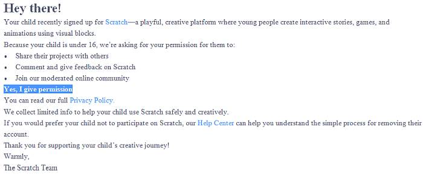
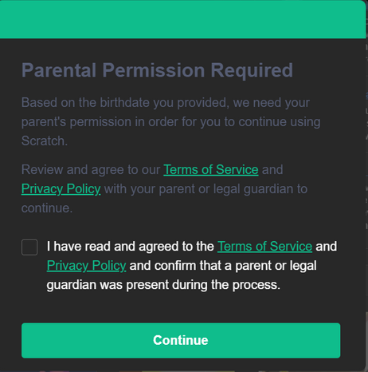

# Wokingham Library Code Club

## Next Code Club sessions: Saturday 7th February 2026

Our next sessions will take place on **Saturday 7th February 2026** in the *small meeting room* at Wokingham Library, Carnival Hub, Wellington Road, RG40 2AF.

<h2>
$\color{#f00}{\textsf{PLEASE MAKE SURE YOU KNOW YOUR PASSWORD FOR LOGGING IN TO YOUR ACCOUNT(S)!!!!!!!}}$
</h2>

---

These are the github pages of the **Wokingham Library Code Club**, located in Wokingham, UK and supported by [Wokingham Borough Council](https://www.wokingham.gov.uk/libraries).

The club is for children aged 9 to 13, and we run twice a month in Wokingham Library, on the first and last Saturday of each month, with an early session mostly for Scratch coding followed by a later session for Python coding.

These pages contain information for students about forthcoming sessions, detailed information for lots of the projects we have developed in the past, as well as background information.

Students wishing to join the Code Club will need to register with Wokingham library. For information about registering and any other enquiries about the Code Club please contact Wokingham library: libraryevents@wokingham.gov.uk

---

### About this website

As is normal on github, the data on this site is divided into ***repositories*** and each repository (repo for short) contains all the information for a single coding project, or a group of projects. One repository, called [OnlineCodeclub](https://github.com/WokLibCodeClub/OnlineCodeclub/blob/master/README.md), contains a wide range of Scratch and Python projects, each of which is explained through a series of Youtube videos, and the links to all these videos can be found in the *OnlineCodeClub* repository. (These projects were created while the code club was operating online during the coronavirus restrictions.)

For a summary of the contents of all the repositories see [here](https://github.com/WokLibCodeClub/woklibcodeclub.github.io), or see the [complete list of repositories](https://github.com/orgs/WokLibCodeClub/repositories?type=all).

---

## Scratch (first session 10.30am to 11.30am)

The next session will take place on **Saturday 7th February 2026**. We will be coding on the library's own laptops, so you don't need to bring your own computer.

After our exploration of video sensing with the laptop camera in the last session we are going to extend this and introduce the important topic of Scratch ***clones*** at the next session.

We will build up the code on the screen for you to follow along, or you can look at a powerpoint presentation to get you going. The link is [Clones and Cloning_WBL Code Club.pptx](https://1drv.ms/p/c/0ea54730735a1344/IQCiIX6zHqU9TZlicNbhJusRAS4VLys1d78zdWrkYwPzbjg?e=C5FiEb).

If you want to revise what we did at the last session - making a game using *video motion sensing*, where we use the laptop camera to detect your body motion and cause the sprites to move accordingly - here is the link to the starter code for this project [Video Motion Sensing Starter Project](https://scratch.mit.edu/projects/1140871196/editor/), and you can look at the instructions for this project in a powerpoint file 
[Video_Motion_Sensing_Scratch_Game_2026.pptx](https://1drv.ms/p/c/0ea54730735a1344/IQC8JJyfUUmjRp3xaB4RTM5iAbX3a58Y1xTgOWWHTxiyvVQ?e=YxB1S5)

<!-- 
Please try to arrive a little bit before 10.30am so that you have time to get logged in to your Code for Life and Scratch accounts and be ready to start at 10.30am. **MAKE SURE YOU KNOW THE PASSWORDS FOR YOUR ACCOUNTS!!!!**
-->

### How to make a Scratch account

If you don't have an account already you can create one by going to [Join Scratch](https://scratch.mit.edu/join). You will need to use a parent's valid email address to sign up.

### Important changes to Scratch user accounts

Scratch has recently made some changes to the terms and conditions which require age verification by a parent or adult, for users under 16 years old. If you are making a new account this will consist of an email sent to the parent's email address with a box to click to confirm that you give permission to your child to use Scratch:



***IT IS ESSENTIAL THAT YOU GIVE PERMISSION OTHERWISE YOUR CHILD WILL NOT BE ABLE TO USE SCRATCH PROPERLY IN THE CODE CLUB SESSIONS!***

Some users might find an extra step is required when they try to log on to their accounts. They might see a pop-up window like this:



This process needs to be carried out by the parent, and will need the parent or responsible adult to fill in their email address. Again, it is essential that you do this to enable your child to use Scratch properly.

Once the Scratch user's account has been confirmed the user will be able to *SHARE* projects without any further action.

**Link for the Code Club's Scratch _Studio_**

We use a *Studio* on the Scratch website for sharing projects in the Code Club sessions. The link to this is [WLCC 2025-2026](https://scratch.mit.edu/studios/50686841). Don't forget, if you want to put a project in the Studio you must *SHARE* it first.

### Don't forget *Rapid Router*

If you want to keep improving your coding skills don't forget the [*Rapid Router*](https://www.codeforlife.education/rapidrouter/#) game. ***Please note:*** you need a Code for Life login to access most levels above 21. If you do not have a login please follow the instructions [below](#How-to-make-a-Code-for-Life-account) to make one. 

*Rapid Router* is a lot of fun, but it's much more than a game - it is a very clever way of teaching the main elements of good coding. But, to make the most of it, you have to try and get full marks for every level. If you're don't do this you will be missing out on the learning opportunities of this game.

#### How to make a Code for Life account

To make a *Code for Life* account you will need to use a parent's email address. Go to [www.codeforlife.education/register_form](https://www.codeforlife.education/register_form): enter your date of birth in the **Independent learner** section then fill in the rest of the details, including your parent's email address. Once you have made an account you can login by going to [www.codeforlife.education/play/](https://www.codeforlife.education/play/) and clicking on the *Log in* button.

---

## Python (second session 11.45am to 12.45pm)

The next session will take place on **Saturday 7th February 2026**. We will be coding on the library's own laptops, so you don't need to bring your own computer.

Please try to arrive a little bit before 11.45am so that you have time to get logged in to your trinket account and be ready to start at 11.45am. **MAKE SURE YOU KNOW THE PASSWORD FOR YOUR ACCOUNT!!!!**

#### For those new to Python ####

We will continue with our Python introduction sessions, and complete the Age Calculator programme, started at the last session, which will involve using the Python ```if else``` block. If there's time we will start drawing graphics patterns using *turtles!*

You can follow along with the coding on the screen in the Code Club session, or you can look at the material which we will cover here: [Hello Python](https://github.com/WokLibCodeClub/Hello-Python/blob/main/README.md)

Python coding is much more fun if you can type well - with two hands if possible! Here is a link to an online course which you can use to improve your typing: [Dance Mat Typing](https://www.bbc.co.uk/bitesize/articles/z3c6tfr).

During the last session we discussed the rules for making Python variables. If you want to look up the rules here is the link: [Variable names](https://github.com/WokLibCodeClub/Hello-Python/blob/main/step1/step1.md#variable-names).

<details><summary></summary>

Have you had a birthday yet this year?
  
</details>

#### For those with experience of coding in Python ####

At the last session our more experienced Python coders got stuck in to these two projects on the Raspberry Pi website:

- [Turtle Race](https://projects.raspberrypi.org/en/projects/turtle-race) where you code several Python turtles to race against one another

Here is a demo of the basic Turtle Race (click Play to start it if the animation doesn't start automatically):


- [Secure Messages](https://projects.raspberrypi.org/en/projects/secure-messages) which uses Python to encrypt and decrypt secret messages..

```
Special Instructions for Turtle Race and Secure Messages:
========================================================

DON'T follow the link to the starter project on the Raspberry Pi website
as this will take you to a different Python editor where you won't be able
to save your code.

Instead, create a New Project in your trinket account and give it a name.

As the first line of your code in the new project insert this:

#!/bin/python3

After that you can follow the instructions on the Raspberry Pi site.
```

If you have finished both these projects then have a go at one of the more complicated projects below:

#### More complicated projects for those who have done some of the beginner Python projects already:

1. [Rock, Paper Scissors with turtles](https://github.com/WokLibCodeClub/Rock-Paper-Scissors-with-Turtles/blob/master/README.md). This is an animated version of Rock, Paper Scissors with You versus The Computer and uses turtle images to show the different hand shapes. The project uses a lot of Python lists, and some very clever logic for working out who has won.

2. [Hangman](https://github.com/WokLibCodeClub/Hangman/blob/master/README.md) This is a very old game which people used to play using paper and pencil. In the computer version you have to guess a mystery word by suggesting letters and finding out if they are in the word or not. If you don't get the word in six guesses you will be hanged!!! This project also shows how you can import data from a text file into a Python project. We have updated the instructions to show how to import your own word list into the game.

3. [Python clock](https://github.com/WokLibCodeClub/Python-Clock/blob/master/README.md). We made this project when the classroom clock broke, and we needed to be able to tell the time to know when to go home. You will make a digital clock with Python first, then extend it to make a round clock with hands, using Python turtles.

4. [Space Race](https://github.com/WokLibCodeClub/SpaceRace/blob/master/README.md). Move your rocket from the bottom to the top of the screen - but if you get hit by an asteroid on the way you will be instantly transported back to the start! This is a re-creation of an arcade game which was first invented in the 1970s. The instructions will show you how to build the game, but they don't give a complete explanation of how the code is actually working. You will have to look at your code as you write it and figure this out for yourself.


### How to make a Trinket account

You will need a trinket account for the Code Club's Python sessions. If you don't have one already you can create one by going to [trinket.io/signup](https://trinket.io/signup). You will need a valid email address to create an account. You can find a guide for using a trinket account [here](https://github.com/WokLibCodeClub/Hello-Python/blob/main/trinket_basics/using_trinket.md).

#### Trinket is closing down in August 2026.

Unfortunately the trinket website will be shutting down in August 2026, so we will need to find an alternative site to use for our Python sessions. We are currently trying out different options but luckily there are still a few months left before we have to choose. We will continue to use trinket as before, for the time being, and we will help users to save any code they've written on trinket before it closes.
