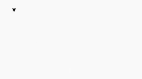

These are the github pages of the **Wokingham Library Code Club**, located in Wokingham, UK and supported by [Wokingham Borough Council](https://www.wokingham.gov.uk/libraries).

The club is for children aged 9 to 12, and we run twice a month in Wokingham Library, on the first and fourth Saturday of each month, with a session for Scratch coding followed by a session for Python coding.

These pages contain information for students about forthcoming sessions, detailed information for lots of the projects we have developed in the past, as well as background information. As is normal on github, the data on this site is divided into ***repositories*** and each repository (repo for short) contains all the information for a single coding project, or a group of projects. One repository, called [OnlineCodeclub](https://github.com/WokLibCodeClub/OnlineCodeclub), gives information about all the projects we created while the code club was operating online during the coronavirus restrictions. For each of the online sessions we created a summary video, and the links to all these videos can be found in the OnlineCodeClub repository.

For a summary of the contents of all the repositories see [here](https://github.com/WokLibCodeClub/woklibcodeclub.github.io), or see the [complete list of repositories](https://github.com/orgs/WokLibCodeClub/repositories?type=all).

#### Lower Earley Code Club

Wokingham Libraries now also runs a Code Club at Lower Earley Library. Ask for details at Lower Earley Library.

### Next sessions

Our next sessions will take place on Saturday 5th October 2024.

#### Scratch

The Scratch session will begin at 10.30 am. You will need a Scratch account for this session, so if you don't have one already you should create one by going to [Join Scratch](https://scratch.mit.edu/join). You will need a valid email address to sign up.

Please make sure you arrive so that you have time to log in to your Scratch account and be ready to start coding at 10.30 am. ***PLEASE*** make sure you know your password (write it down if you need to) so that you are able to log in without a problem on Saturday.

We will continue with the [*Space Talk* project](https://projects.raspberrypi.org/en/projects/space-talk), and build up the code on the screen for those that want to follow along. If you are happy to work on your own from instructions on a website we can show you other projects you can build.

**NOTE**: If you want to be able to *share* your Scratch projects with the club leaders and other coders your Scratch account needs to be *confirmed*. You can find the instructions for doing this at [this](https://scratch.mit.edu/faq/#accounts) weblink, under the heading *How do I confirm my account?*. It seems to be quite common that people can't find the first email sent by Scratch. In this case, follow the instructions for receiving another copy.

Scratch has produced a page of information for parents. You can find it [here](https://scratch.mit.edu/parents/).

If you have never done any coding before we recommend trying out a game called [Rapid Router](https://www.codeforlife.education/rapidrouter) on the *Code For Life* website. This is a game with many levels which get more and more difficult, and introduce the main concepts of coding. If you want to save your scores as you go through the levels you can create a Code For Life account at [https://www.codeforlife.education/register_form](https://www.codeforlife.education/register_form): enter your date of birth in the **Independent learner** section then fill in the rest of the details, including your parent's email address. Once you have made an account you can login by going to [codeforlife.education/play/](https://www.codeforlife.education/play/) and clicking on the Log in button.

#### Python

The Python session will start at 11.45 am.

You will need an account with [trinket](https://trinket.io/) for this session, so if you don't have one already you should create one by going to [trinket.io/signup](https://trinket.io/signup). You will need a valid email address to sign up.

Please make sure you arrive so that you have time to log in to your trinket account and be ready to start coding at 11.45 am.

- **Python from the beginning**

For those quite new to Python we will continue exploring the basics by writing a simple *Age Calculator* programme and starting to use Python graphics.

In the previous session on 28 September 2024 we learnt about the functions ```print()``` and ```input()```, and also *imported* other functions from different Python *libraries*. We saw the difference between *text strings*, *whole numbers (integers)* and *decimal or floating-point numbers*; and made some variables. You can find the code which was written on the screen during the first session by going to [https://trinket.io/python/104fce5c53d0](https://trinket.io/python/104fce5c53d0).

- **For more experienced coders**

Those who are familiar with Python can continue working on a Raspberry Pi/Code Club project called [Turtle Race](https://projects.raspberrypi.org/en/projects/turtle-race), or if they have finished that they can go on to the [Secret Messages project](https://projects.raspberrypi.org/en/projects/secret-messages) which uses Python to put messages into encrypted form.

Here is a demo of the Turtle Race (click Play to start it):



```
Special Instructions for Turtle Race and Secret Messages:
========================================================

DON'T follow the link to the starter project on the Raspberry Pi website
as this will take you to a different Python editor where you won't be able
to save your code.
Instead, create a New Project in your trinket account.
Start your code in trinket with the usual line:

#!/bin/python3

After that you can follow the instructions on the Raspberry Pi site.
```

### Challenges for more experience Python coders:

We have devised a series of Python coding challenges to test your abilities. You can find the challenges at

&nbsp;&nbsp;[https://woklibcodeclub.github.io/site/coding_challenges/index.html](https://woklibcodeclub.github.io/site/coding_challenges/index.html)
