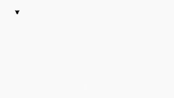

# Wokingham Library Code Club

## Next Code Club sessions: Saturday 26th September 2026

<h2>
$\color{#f00}{\textsf{PLEASE MAKE SURE YOU KNOW YOUR PASSWORD FOR LOGGING IN TO YOUR ACCOUNT(S)!!!!!!!}}$
</h2>

---

These are the github pages of the **Wokingham Library Code Club**, located in Wokingham, UK and supported by [Wokingham Borough Council](https://www.wokingham.gov.uk/libraries).

The club is for children aged 9 to 13, and we run twice a month in Wokingham Library, on the first and last Saturday of each month, with an early session mostly for Scratch coding followed by a later session for Python coding.

Students wishing to join the Code Club will need to register with Wokingham library. For information about registering and any other enquiries about the Code Club please contact Wokingham library: libraryevents@wokingham.gov.uk

These pages contain information for students about forthcoming sessions, detailed information for lots of the projects we have developed in the past, as well as background information.

---

### About this website

As is normal on github, the data on this site is divided into ***repositories*** and each repository (repo for short) contains all the information for a single coding project, or a group of projects. One repository, called [OnlineCodeclub](https://github.com/WokLibCodeClub/OnlineCodeclub/blob/main/README.md), contains a wide range of Scratch and Python projects, each of which is explained through a series of Youtube videos, and the links to all these videos can be found in the *OnlineCodeClub* repository. (These projects were created while the code club was operating online during the coronavirus restrictions.)

For a summary of the contents of all the repositories see [here](https://github.com/WokLibCodeClub/woklibcodeclub.github.io), or see the [complete list of repositories](https://github.com/orgs/WokLibCodeClub/repositories?type=all).

---

## Scratch (first session 10.30am to 11.30am)

The first session of the new term will take place on **Saturday 26th September 2026**. If you are going to take part in this session you will need accounts with Scratch, and Code for Life - details below.

We write code on the library's laptops, so you do not need to bring your own computer.

<!-- 
Please try to arrive a little bit before 10.30am so that you have time to get logged in to your Code for Life and Scratch accounts and be ready to start at 10.30am. **MAKE SURE YOU KNOW THE PASSWORDS FOR YOUR ACCOUNTS!!!!**
-->

In our first session this term we will start off using Rapid Router, which is a block coding game.  There are several levels in the game.  The goal on each level is to safely navigate a delivery van driver from a warehouse to a customer's house.  Unlike a traditional computer game that uses keyboard arrow keys to control the van we will use code blocks to create a sequence of instructions to guide the van instead.

During the second half of the session we will look at the Scratch program and explore the different parts of the interface. Then we will begin to create an animated space-scene project in which alien characters ("sprites") react with sounds, dialogue and visual effects when clicked.  

### How to make a Scratch account

If you don't have an account already you can create one by going to [Join Scratch](https://scratch.mit.edu/join). You will need to use a parent's valid email address to sign up.

#### Parental consent for Scratch accounts

Scratch has recently made some changes to the terms and conditions which require age verification by a parent or adult, for users under 16 years old. This will consist of **an email sent to the parent's email address with a box to click to confirm that you give permission to your child to use Scratch**.

***PARENTS: IT IS ESSENTIAL THAT YOU GIVE PERMISSION OTHERWISE YOUR CHILD WILL NOT BE ABLE TO USE SCRATCH PROPERLY IN THE CODE CLUB SESSIONS!***

### How to make a Code for Life account

To make a *Code for Life* account you will need to use a parent's email address. Go to [www.codeforlife.education/register_form](https://www.codeforlife.education/register_form): enter your date of birth in the **Independent learner** section then fill in the rest of the details, including your parent's email address. Once you have made an account you can login by going to [www.codeforlife.education/play/](https://www.codeforlife.education/play/) and clicking on the *Log in* button.

### Code Club Scratch Studio

We encourage our coders to share their code with others in the group, which they can do by uploading projects to the Code Club's *Scratch Studio*. This is a page on the Scratch website for sharing projects. The link is [WLCC 2026-27](https://scratch.mit.edu/studios/51996147). **Note** if you want to load one of your projects to the studio you must ***share*** it first. We will show you how to add projects to the studio at the next session.

The studio is only open for adding projects during Code Club sessions at the library. At other times you can't add projects but you can look at the projects which are already there.

---

## Python (second session 11.45am to 12.45pm)

The first session of the new term will take place on **Saturday 26th September 2026**. We will be coding on the library's own laptops, so you don't need to bring your own computer. If you are going to take part in this session you will need an account with ***trinket***, which is a community-hosted coding website, run by [Strive Math](https://www.strivemath.org/) - details below.

Please try to arrive a little bit before 11.45am so that you have time to get logged in and be ready to start at 11.45am. **MAKE SURE YOU KNOW THE PASSWORD FOR YOUR ACCOUNT!!!!**

#### For Python beginners, or those with only a little experience of Python

We will be teaching a beginner course over the next four sessions which will take in the basic commands, and cover different types of Python objects. It will also include some graphics coding where we programme Python turtles to move around the screen.

At the end of each session we will post a link to the code written during the session on this web page.

#### Projects for those who are already familiar with the basic Python commands

We recommend you try one or other of these two projects from the Raspberry Pi Code Club website:

- [**Turtle Race**](https://projects.raspberrypi.org/en/projects/turtle-race)

Here is a demo of the basic Turtle Race (click Play to start it if the animation doesn't start automatically):



- [**Secure Messages**](https://projects.raspberrypi.org/en/projects/secure-messages)

```
Special Instructions for Turtle Race and Secure Messages:
========================================================

DON'T follow the link to the starter project on the Raspberry Pi website
as this will take you to a different Python editor where you won't be able
to save your code.

Instead, create a New Project in your trinket account and give it a name.

As the first line of your code in the new project insert this:

#!/bin/python3

After that you can follow the instructions on the Raspberry Pi site.
```

#### Projects for those who know Python coding and are looking for some more difficult and challenging projects:

1. [Rock, Paper Scissors with turtles](https://github.com/WokLibCodeClub/Rock-Paper-Scissors-with-Turtles/blob/master/README.md). This is an animated version of Rock, Paper Scissors with You versus The Computer and uses turtle images to show the different hand shapes. The project uses a lot of Python lists, and some very clever logic for working out who has won.

2. [Hangman](https://github.com/WokLibCodeClub/Hangman/blob/master/README.md) This is a very old game which people used to play using paper and pencil. In the computer version you have to guess a mystery word by suggesting letters and finding out if they are in the word or not. If you don't get the word in six guesses you will be hanged!!! This project also shows how you can import data from a text file into a Python project. We have updated the instructions to show how to import your own word list into the game.

3. [Python clock](https://github.com/WokLibCodeClub/Python-Clock/blob/master/README.md). We made this project when the classroom clock broke, and we needed to be able to tell the time to know when to go home. You will make a digital clock with Python first, then extend it to make a round clock with hands, using Python turtles.

4. [Space Race](https://github.com/WokLibCodeClub/SpaceRace/blob/master/README.md). Move your rocket from the bottom to the top of the screen - but if you get hit by an asteroid on the way you will be instantly transported back to the start! This is a re-creation of an arcade game which was first invented in the 1970s. The instructions will show you how to build the game, but they don't give a complete explanation of how the code is actually working. You will have to look at your code as you write it and figure this out for yourself.

### How to make a trinket account

To make a *trinket* account go to [trinket.strivemath.org/signup](https://trinket.strivemath.org/signup) and fill in your email address and password. If you are 12 or under you should use a parent's email address. Otherwise you can use your own email address. Enter the details and create your account. Once you have made an account you can go to [strivemath.org/auth/login](https://strivemath.org/auth/login) and log in.

### Closure of original trinket website

The original trinket site *trinket.io* closed on 31 August 2026. If you had previously written code on this site and not downloaded it to your computer this code will unfortunately have been lost.

### Standalone installation of Python on your own computer

If you don't want to use an online editor for writing Python code you can download Python to your own computer in what is called a "standalone installation". Open the download page at [www.python.org/downloads](https://www.python.org/downloads/) and  get the standalone installer. One advantage of doing this is that you have access to all Python functions, rather than the limited set provided by trinket.

To edit code in a standalone installation open the application called **IDLE**. This opens a Python console which has a **File** menu where you can open or create .py Python code files. You write or paste in your Python code into the code window, save it, and run it by going to the **Run** menu and selecting *Run Module*. The output appears in the console if it is text output, or in a separate graphics window for graphics output (eg a turtle programme). You can find more help at [wiki.python.org/moin/BeginnersGuide](https://wiki.python.org/moin/BeginnersGuide). You can find out more about using the IDLE editor at [realpython.com/python-idle/](https://realpython.com/python-idle/).
