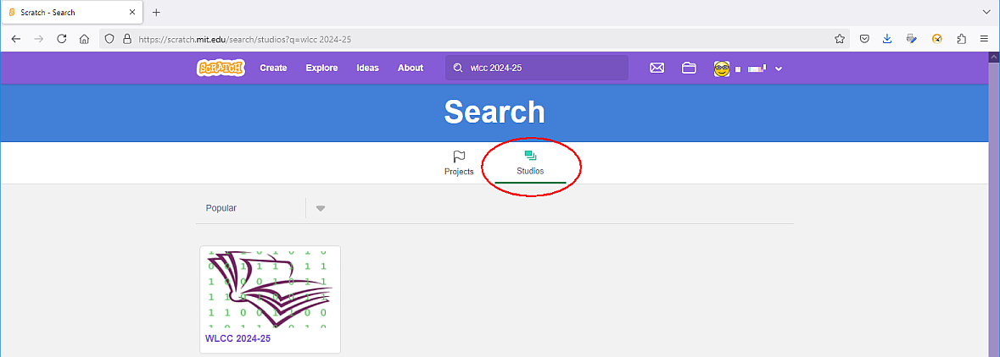

# Wokingham Library Code Club

These are the github pages of the **Wokingham Library Code Club**, located in Wokingham, UK and supported by [Wokingham Borough Council](https://www.wokingham.gov.uk/libraries).

The club is for children aged 9 to 12, and we run twice a month in Wokingham Library, on the first and fourth Saturday of each month, with a session for Scratch coding followed by a session for Python coding.

These pages contain information for students about forthcoming sessions, detailed information for lots of the projects we have developed in the past, as well as background information.

As is normal on github, the data on this site is divided into ***repositories*** and each repository (repo for short) contains all the information for a single coding project, or a group of projects. One repository, called [OnlineCodeclub](https://github.com/WokLibCodeClub/OnlineCodeclub/blob/master/README.md), contains a wide range of Scratch and Python projects, each of which is explained through a series of Youtube videos, and the links to all these videos can be found in the *OnlineCodeClub* repository. (These projects were created while the code club was operating online during the coronavirus restrictions.)

For a summary of the contents of all the repositories see [here](https://github.com/WokLibCodeClub/woklibcodeclub.github.io), or see the [complete list of repositories](https://github.com/orgs/WokLibCodeClub/repositories?type=all).

## Next sessions

Our next sessions will take place on Saturday 3rd May 2025 at Wokingham Library.

## Scratch session, Saturday 3rd May 2025 at 10.30 am

On Saturday we will building a game called *Flappy Parrot* (it's a bit like the well-known game Flappy Bird) which uses C L O N E S (which we learnt about last week). We have made a starter project for this, and the link is [here](https://scratch.mit.edu/projects/1167247767), and a powerpoint file with some instructions. The link to the powerpoint presentation is [here](https://1drv.ms/p/c/0ea54730735a1344/EVmiO9ExKntIgekSxeVq3_YBqf9pHpQTXCzLyKv-9AoIeg?e=8k63cP).

If you missed last week's session, and you want to know about making clones, there is a powerpoint file with some instructions for making clones [here](https://1drv.ms/p/c/0ea54730735a1344/EaIhfrMepT1NmWJw1uEm6xEBeQj0usfzzUkn-8PmNd4TjQ?e=oWNDRc). We have based these instructions on some excellent Youtube tutorials on clones and cloning. If you want to watch the Youtube tutorials (there are four videos) click on [this link](https://www.youtube.com/playlist?list=PLtAXMHI3lbo8HhvpZQQRUcL_4WJEIrvaR).

The link to the version of the Minifigs project which uses clones is [here](https://scratch.mit.edu/projects/1165114649).

You will need a Scratch account for this session, so if you don't have one already you should create one by going to [Join Scratch](https://scratch.mit.edu/join). You will need a valid email address to sign up.

Please make sure you arrive so that you have time to log in to your Scratch account and be ready to start coding at 10.30 am. ***PLEASE*** make sure you know your password (write it down if you need to) so that you are able to log in without a problem on Saturday.

### Confirming your Scratch account so that you can *SHARE* your projects

If you want to be able to *share* your Scratch projects with the club leaders and other coders your Scratch account needs to be *confirmed*. You can find the instructions for doing this at [this](https://scratch.mit.edu/faq/#accounts) weblink, under the heading *How do I confirm my account?*. It seems to be quite common that people can't find the first email sent by Scratch. In this case, follow the instructions to have Scratch resend the email.

Scratch has produced a page of information for parents. You can find it [here](https://scratch.mit.edu/parents/).

### Finding the Code Club's Scratch *studio*

The Code Club keeps a Scratch *studio* on the Scratch website, where our students can upload their projects for everyone else to see. **Note:** we only allow you to upload projects during our Scratch sessions at the library. At other times uploading is disabled. 

If you want to find our Scratch studio, so you can see the other projects there, here are the steps you need to take:

1. Log in to your Scratch account
2. In the Search box at the top type in WLCC 2024-25

3. When the search results appear it will probably say **Nothing Found**, so click on the heading Studios above the search results

4. You will now see the icon for the studio. Click on this to open the studio.

Alternatively, you can use the URL for the page, which is [scratch.mit.edu/studios/35685710/](https://scratch.mit.edu/studios/35685710/)

### Rapid Router

Some students might like to continue with a bit more of the [Rapid Router game](https://www.codeforlife.education/rapidrouter) on the *Code For Life* website as some of our coders have been getting very enthusiastic about this. If you would like to save your progress and your code as you work through the levels, you should make yourself a *Code for Life* account by following the instructions below:

#### Signing up for a Code for Life account

If you want to save your progress in *Code for Life* as you progress through the levels you can make a *Code for Life* account, and to do this you will need to use a parent's email address. We will show you how you can do this at the session, but you will need to do this at home during the week. The webpage for signing up is [https://www.codeforlife.education/register_form](https://www.codeforlife.education/register_form): enter your date of birth in the **Independent learner** section then fill in the rest of the details, including your parent's email address. Once you have made an account you can login by going to [codeforlife.education/play/](https://www.codeforlife.education/play/) and clicking on the Log in button.

## Python session, 3rd May 2025 at 11.45 am

On Saturday 3rd May 2025 we will be using Python to write code for BBC microbits:

We do the coding online using the microbit:Python editor which is at [python.microbit.org/v/3](https://python.microbit.org/v/3). Unfortunately there is no facility to make an account or login to this editor, so we will probably save any code to a memory stick so it's available at following sessions.

For anyone who doesn't want to code microbits we will be available to help students working on their own projects, following online instructions. Those that are very new to Python might prefer to continue with the introductory *Hello Python* set of instructions, as this might be less confusing than trying to code the microbits.

You will need an account with [trinket](https://trinket.io/) for this session, so if you don't have one already you should create one by going to [trinket.io/signup](https://trinket.io/signup). You will need a valid email address to sign up.

Please make sure you arrive so that you have time to log in to your trinket account and be ready to start coding at 11.45 am.

Here are some suggestions for projects suitable for different levels of Python experience:

### Projects to compile yourself from online instructions

#### Project for those with very little Python experience:

We suggest following our beginners Python course called *Hello Python* which you can find [here](https://github.com/WokLibCodeClub/Hello-Python/blob/main/README.md).

#### Projects for those who have done some of the first Python projects already:

Here are some suggestions for projects. If you follow the links you will find step by step instructions for building up your project:

1. [Rock, Paper Scissors with turtles](https://github.com/WokLibCodeClub/Rock-Paper-Scissors-with-Turtles/blob/master/README.md). This is an animated version of Rock, Paper Scissors with You versus The Computer and uses turtle images to show the different hand shapes. The project uses a lot of Python lists, and some very clever logic for working out who has won.

2. [Hangman](https://github.com/WokLibCodeClub/Hangman/blob/master/README.md) This is a very old game which people used to play using paper and pencil. In the computer version you have to guess a mystery word by suggesting letters and finding out if they are in the word or not. If you don't get the word in six guesses you will be hanged!!! This project also shows how you can import data from a text file into a Python project. We have updated the instructions to show how to import your own word list into the game.

3. [Python clock](https://github.com/WokLibCodeClub/Python-Clock/blob/master/README.md). We made this project when the classroom clock broke, and we needed to be able to tell the time to know when to go home. You will make a digital clock with Python first, then extend it to make a round clock with hands, using Python turtles.

4. [Space Race](https://github.com/WokLibCodeClub/SpaceRace/blob/master/README.md). Move your rocket from the bottom to the top of the screen - but if you get hit by an asteroid on the way you will be instantly transported back to the start! This is a re-creation of an arcade game which was first invented in the 1970s. The instructions will show you how to build the game, but they don't give a complete explanation of how the code is actually working. You will have to look at your code as you write it and figure this out for yourself.

### Challenges for more experience Python coders:

We have devised a series of Python coding challenges to test your abilities. You can find the challenges at

&nbsp;&nbsp;[https://woklibcodeclub.github.io/site/coding_challenges/index.html](https://woklibcodeclub.github.io/site/coding_challenges/index.html)
